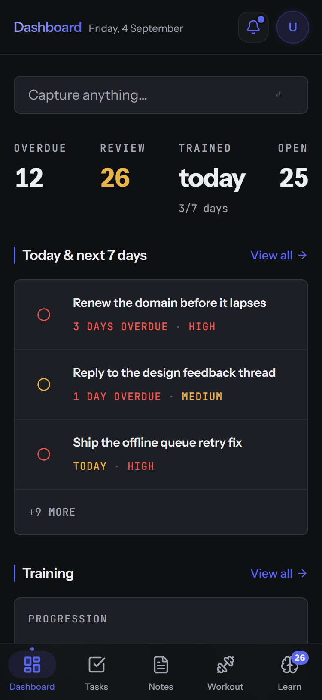
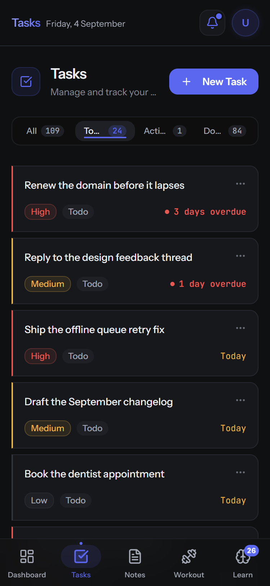
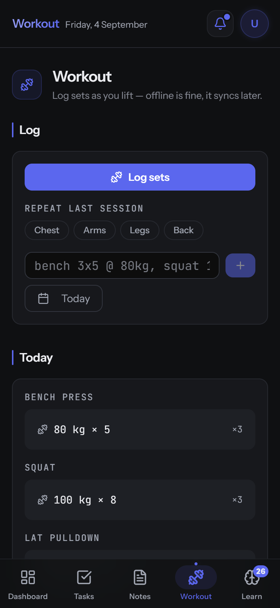
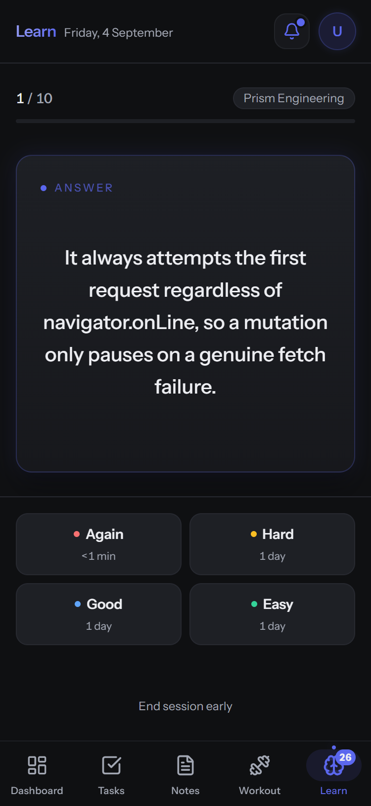
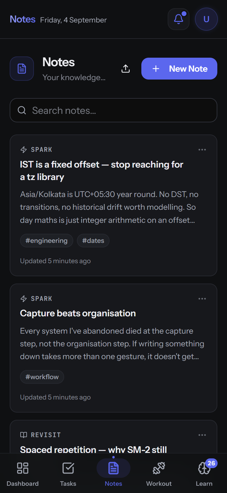
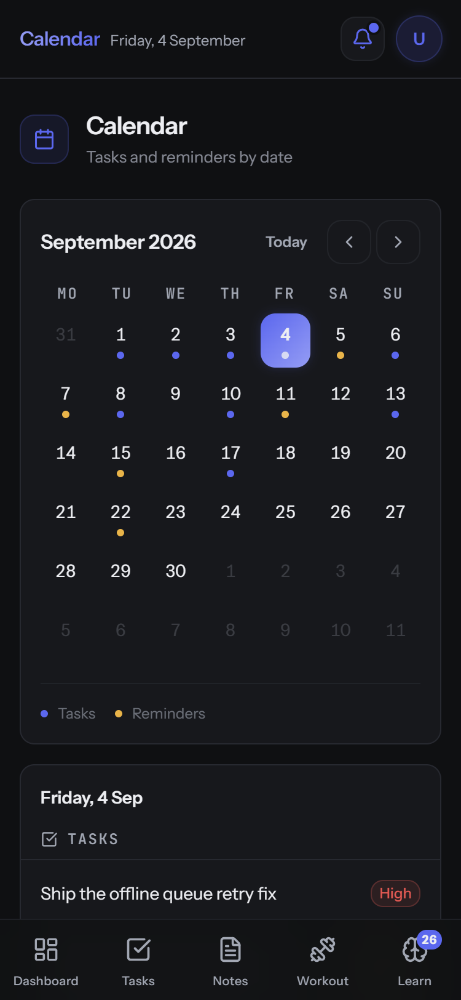
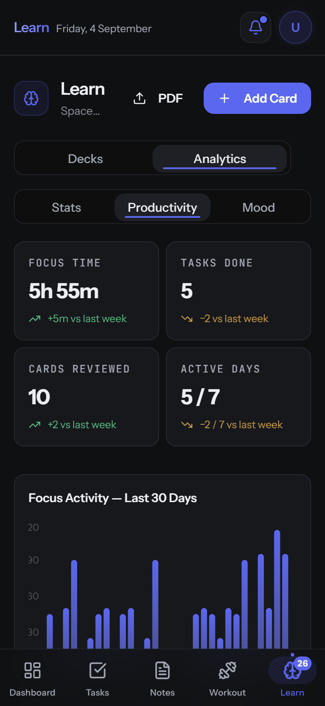
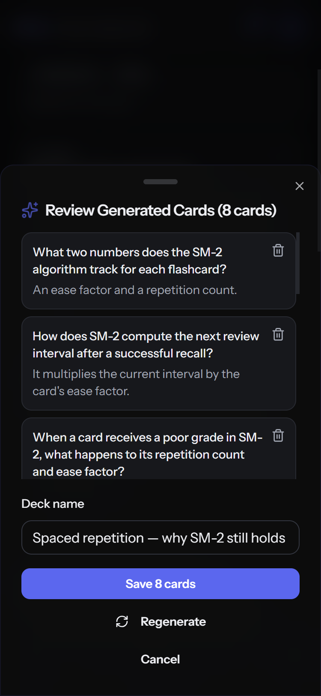

# PRISM

AI-native personal productivity and spaced-repetition learning — capture
your work, study with flashcards, and let an LLM turn your notes, PDFs, and
YouTube videos into review-ready cards.

## Screenshots

Captured on a 375×812 mobile viewport at 2×, against a production build.

| | |
|:--|:--|
|  |  |
| **Dashboard** — a capture field, four drift counters (overdue, review, trained, open), then the week's agenda, training and revisit notes as contained sections. | **Tasks** — status filter tabs above task rows carrying priority, status, and due date. |
|  |  |
| **Workout** — gym shorthand parsed into individual sets; identical consecutive sets collapse into one row with a set count. | **Review** — the answer side of a due card with the four SM-2 grades and the interval each one would schedule. |
|  |  |
| **Notes** — each card carries its kind (Spark or Revisit), a markdown excerpt and its tags, above full-text search. | **Calendar** — a bespoke IST-safe month grid; dots mark the days holding tasks or reminders, with the selected day expanded below. |
|  |  |
| **Analytics** — this week measured against last, then focus minutes across the last 30 days and the split by category. | **AI generation** — flashcards drafted from a note, each one removable; nothing is written until the deck is confirmed. |

## What it does

- **Tasks** with priorities, due dates, plan linking, recurring templates, and
  swipe-to-complete on mobile. Completion tracked via a dedicated
  `completed_at` column.
- **Plans** that group tasks into goals with progress bars computed from
  linked-task completion.
- **Notes** with a custom markdown renderer (no third-party library), tag
  chips, full-text search, and a dual-mode read/edit modal.
- **Reminders** with browser notifications and web push. Delivered reminders
  are marked `is_sent = true` and kept as history in a Sent tab — they are
  never deleted.
- **Calendar** with a bespoke, IST-safe month grid showing tasks by due date
  and reminders by time.
- **Focus timer** with categories, a global floating timer that survives
  navigation, and session history feeding analytics.
- **Workout log** written as typed shorthand ("Lat pulldown 3 set 70 kgs"),
  parsed server-side by an LLM into individual set rows — exercise, weight,
  reps, set index — with the raw input stored verbatim on every row, so a bad
  parse is correctable rather than permanent. The parse runs inside the POST,
  so it rides the offline mutation queue. Identical consecutive sets collapse
  into one display row.
- **Countdowns** and **daily mood check-ins**.

### Spaced repetition

- **SM-2 scheduling** with a flip-card review UI and four grades (Again /
  Hard / Good / Easy).
- **Decks** with rename, bulk delete, and per-card edit.
- **Streak tracking** with three auto-applied freezes per week that cover a
  single missed day.

### AI flashcard generation

Three ingestion pipelines converge on one review queue:

- **From notes** — Groq / GPT-OSS 120B turns note content into Q&A cards.
- **From PDFs** — a storage-backed pipeline that uploads directly to a private
  Supabase Storage bucket (sidestepping the serverless request-body limit),
  extracts per-page text with `pdf-parse`, chunks it, and merges results with
  Jaccard near-duplicate detection. No OCR — scanned PDFs fail with a typed
  error.
- **From YouTube** — captions fetched from the Supadata transcript API,
  cleaned, chunked, and run through the same generation and merge stage.

### Insights

- **Learning analytics** — review activity, mastery counts, per-deck
  performance.
- **Productivity analytics** — focus, task, and review trends over a 30-day
  IST window, with peak-hour and best-weekday detection.
- **Weekly review** — a Mon–Sun digest with best and quietest day and
  deterministic insights.

## Stack

| Layer | Technology |
|---|---|
| Framework | Next.js 14 (App Router) · React 18 · TypeScript (strict) |
| Database & Auth | Supabase — Postgres, Row-Level Security, Storage, SSR auth |
| Styling | Tailwind CSS v3 · shadcn/ui (Radix primitives) |
| Server state | TanStack Query v5 |
| UI state | Zustand v5 |
| AI | Groq — GPT-OSS 120B (`openai/gpt-oss-120b`) |
| Transcripts | Supadata transcript API |
| PDF | `pdf-parse` |
| Charts | Recharts |
| Notifications | Web Push (VAPID) · `@ducanh2912/next-pwa` service worker |
| Dates | `date-fns` + custom IST helper module (`lib/date.ts`) |
| Deployment | Vercel · Supabase · `pg_cron` |

## Architecture notes

### IST date anchoring

All civil-date logic is anchored to **Asia/Kolkata** through `lib/date.ts`.
Raw `new Date()` day arithmetic is banned — the server runs in UTC and would
miscompute "due today," streak days, weekly boundaries, and the calendar
grid. Helpers convert between epoch instants and IST day indices. The
calendar's Monday-first weekday math and the dashboard's date chip and clock
all derive from IST, so the app rolls over at IST midnight regardless of
where it's deployed.

### Offline mutation queue

TanStack Query's persistence layer snapshots the five core query caches to
IndexedDB, scoped per-user so switching accounts cannot leak data. Mutations
created while offline are paused and replayed when connectivity returns.
Each resumable mutation registers a `mutationKey` and default `mutationFn`
in `lib/offline-mutations.ts` — callbacks are not serialised, so side effects
that span multiple mutations (like creating a reminder inside a task
mutation) must be collapsed into a single request.

### Supabase Cron scheduling

Two `pg_cron` jobs drive background work:

- **Reminder pushes** (`/api/push/due`, every minute) — uses the
  service-role admin client to find every user's due, unsent reminders, sends
  web pushes via VAPID, sets `is_sent = true` on success, and prunes dead
  subscriptions. Guarded by an `x-cron-secret` header.
- **Recurring task spawn** (`/api/cron/recurring-tasks`, daily at 00:05 IST)
  — materialises today's tasks from active `recurring_tasks` templates,
  idempotent (one per template per IST day).

## Local setup

### Prerequisites

- Node.js 20 (the project targets `@types/node@^20`)
- A Supabase project
- A Groq API key ([console.groq.com](https://console.groq.com))

### Steps

```bash
git clone https://github.com/UditBuilds/Prism-Productivity-Tool.git
cd Prism-Productivity-Tool
npm install
cp .env.local.example .env.local
```

Fill in `.env.local`:

| Variable | Required | Purpose |
|---|---|---|
| `NEXT_PUBLIC_SUPABASE_URL` | yes | Supabase project URL |
| `NEXT_PUBLIC_SUPABASE_ANON_KEY` | yes | Supabase anon key |
| `SUPABASE_SERVICE_ROLE_KEY` | yes | Service-role key (server-only) |
| `GROQ_API_KEY` | yes | Groq API key for flashcard generation |
| `NEXT_PUBLIC_APP_URL` | no | Deployed URL for password-reset redirects |
| `NEXT_PUBLIC_VAPID_PUBLIC_KEY` | no | Web push public key |
| `VAPID_PRIVATE_KEY` | no | Web push private key |
| `VAPID_SUBJECT` | no | `mailto:` for VAPID |
| `CRON_SECRET` | no | Shared secret for `/api/push/due` |
| `SUPADATA_API_KEY` | no | YouTube → flashcards |

Run `supabase/schema.sql` in the Supabase SQL editor to create the tables,
then:

```bash
npm run dev      # http://localhost:3000
```

Verify with `npx tsc --noEmit && npm run lint` before pushing.

Full deployment instructions (Vercel, Supabase Auth config, cron setup) are
in [docs/DEPLOYMENT.md](docs/DEPLOYMENT.md).

## Project structure

```
app/                 Next.js App Router
├─ (auth)/           Login, signup, password reset
├─ dashboard/        Feature pages (tasks, notes, learn, calendar, focus, …)
└─ api/              Route handlers (auth-guarded, { data, error } envelope)
components/          Feature UIs + shared shell + shadcn/ui primitives
hooks/               React Query data hooks
lib/
├─ ai/               Groq client + prompts (server-only)
├─ pdf/              Extraction, chunking, dedup-merge pipeline
├─ youtube/          Transcript fetch + chunking
├─ srs/              SM-2 algorithm
├─ supabase/         Browser / server / admin clients
└─ date.ts           IST time helpers
store/               Zustand UI stores
types/               Hand-authored Supabase types
worker/              Custom service-worker source (push handling)
supabase/schema.sql  Full schema (tables, RLS, triggers)
```

## Status

This is a **single-user private beta**. Signups are closed — `/signup`
renders an invite-only notice behind a `SIGNUPS_OPEN` flag, and new signups
are disabled in the Supabase dashboard. There is no user-limit enforced in
code.

TypeScript strict mode is on, with three documented `as any` escapes (each
with an eslint-disable comment) for tables intentionally absent from
`types/database.ts`.

There are **no automated tests** and no CI test runner. Quality gates are
manual: `npx tsc --noEmit && npm run lint` before every push. A CI workflow
runs those same two checks on pull requests and pushes to master.

## License

[MIT](LICENSE) © Udit Kumar
